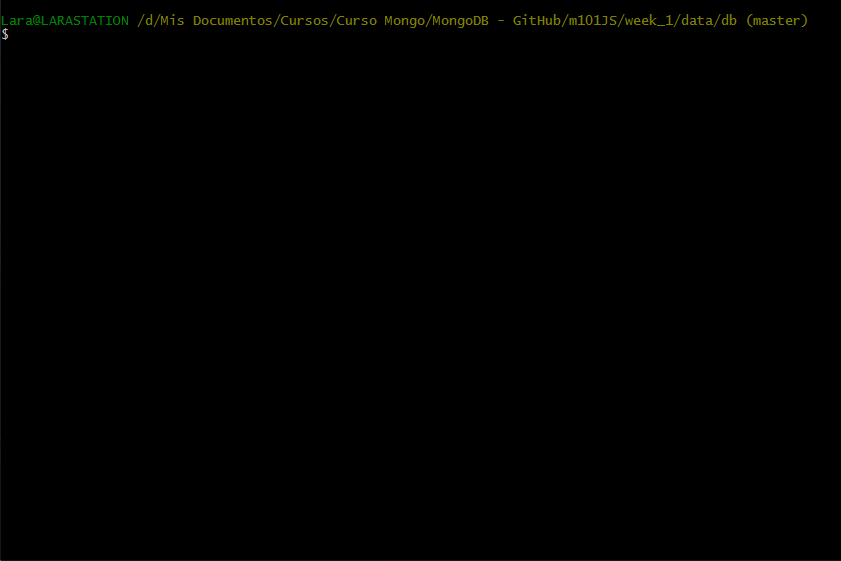
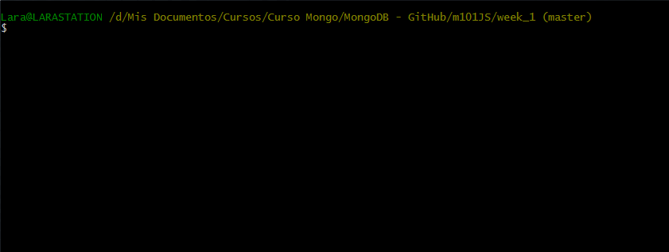
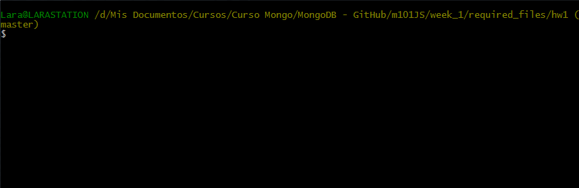
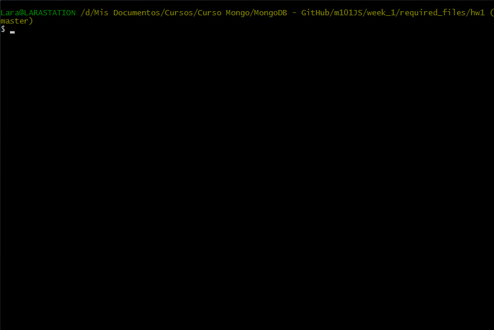

# Homework 1.1

*Introduction video [YouTube - Homework 1.1 (01:47)] [Click me to watch it](https://www.youtube.com/watch?v=sA-iH3IJ72o).*

Install MongoDB on your computer and run it on the standard port.

Download the [hw1-1.zip](https://university.mongodb.com/static/10gen_2015_M101JS_March/handouts/hw1-1.697b6569ff4c.zip Direct download from the MongoDB University site) from Download Handout link and uncompress the file.

Change directory into hw1.

Use ```mongorestore``` to restore the dump into your running mongod. Do this by opening a terminal window (mac) or cmd window (windows) and navigating to the directory so that the dump directory is directly beneath you. Now type:

```sh
mongorestore dump
```

Note you will need to have your path setup correctly to find mongorestore.

Now, using the Mongo shell, perform a ```findOne``` on the collection called ```hw1_1``` in the database ```m101```. That will return one document. Please provide the value corresponding to the "answer" key (without the surrounding quotes) from the document returned.

## Answer
Hello from MongoDB!

## Procedure

First at all, we should create the database ```/data/db``` file system. Once these directories has been created, we can go within them.


It's time to run our MongoDB server. In order to do that, I'm goning to define the location of execution into the ```/data/db``` directory through the ```--dbpath``` option.



After we have correctly executed our MongoDB server, we can minimize its shell and opening a new one.

With this new shell screen, we are going to surf untill the ```hw1``` directory which I have placed within the ```required_files``` folder.



Now, I'm going to run the database restoration through the ```mongorestore``` command.



Once the database has been restored, we can execute our MongoDB shell in order to connect with the database server. To do that, I have used this command ```mongo localhost:27017```.

After I have run the MongoDB shell, I can check that a new database called ```m101``` has been created. Now, I'm going to connect with it and show its collections.



Finally, we can execute the homework achieving the data asked for.


