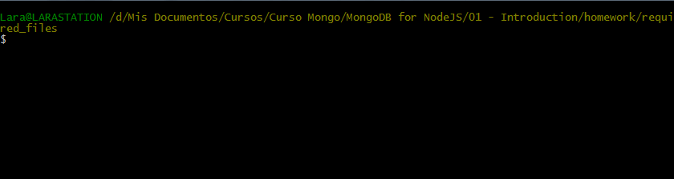
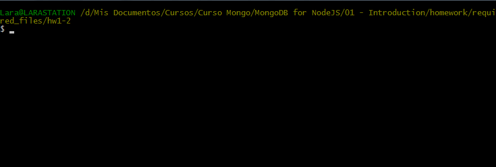
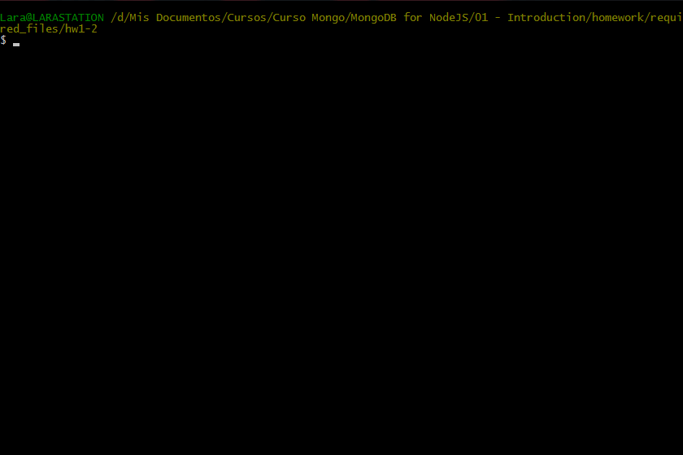
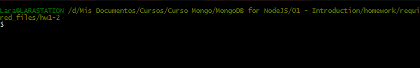

# Homework 1.2

Your assignment for this part of the homework is to install the mongodb driver for Node.js and run the test application.To do this, first download the [hw1-2.zip](https://university.mongodb.com/static/10gen_2015_M101JS_March/handouts/hw1-2.92b836706307.zip Directo download from the MongoDB University site) from Download Handout link, uncompress and change into the ```hw1-2``` directory:

```sh
cd hw1-2
```

Use mongorestore to restore the dump into your running mongod. Do this by opening a terminal window (mac) or cmd window (windows) and navigating to the directory so that the dump directory is directly beneath you. Now type:

```sh
mongorestore dump
```

Note you will need to have your path setup correctly to find mongorestore.

Then install the mongodb driver:

```sh
npm install mongodb
```

This should create a "node_modules" directory. Now run the application to get the answer to ```hw1-2```:

```sh
node app.js
```

If you have the mongodb driver installed correctly, this will print out the message 'Answer: ' followed by some additional text. Write that text in the text box below.

## Answer
I like kittens

## Procedure








