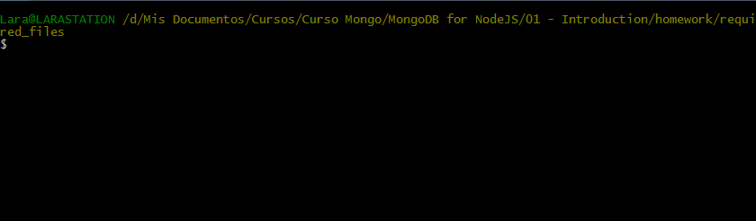
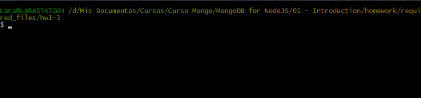
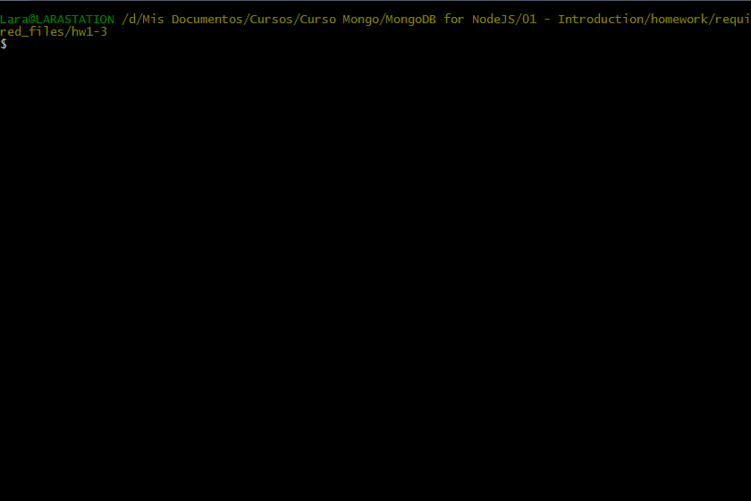
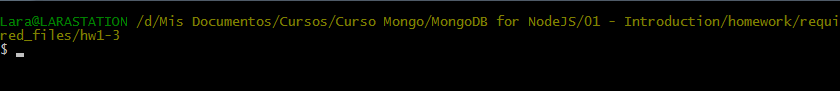
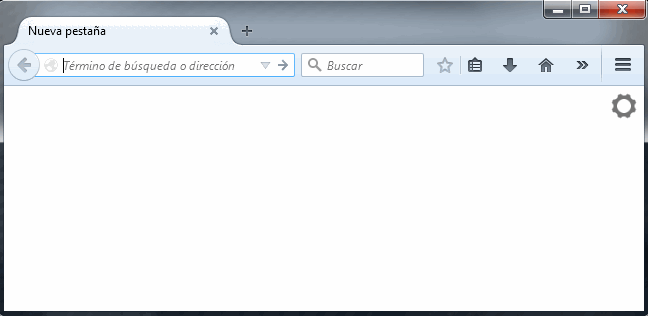

# Homework 1.3

Your assignment for this part of the homework is to install the mongodb driver for Node.js, Express, and other required dependencies and run the test application. This homework is meant to give you practice using the ```package.json``` file, which will include some of the code that we provide.

To do this, first download the [hw1-3.zip](https://university.mongodb.com/static/10gen_2015_M101JS_March/handouts/hw1-3.81c9d0bce74f.zip Direct download from the MongoDB University site) from Download Handout link, uncompress and change into the ```hw1-3``` directory:

```sh
cd hw1-3
```

Use mongorestore to restore the dump into your running mongod. Do this by opening a terminal window (mac) or cmd window (windows) and navigating to the directory so that the dump directory is directly beneath you. Now type:

```sh
mongorestore dump
```

Note you will need to have your path setup correctly to find mongorestore.
Then install all the dependencies listed in the ```package.json``` file. Calling ```npm install``` with no specific package tells npm to look for ```package.json```:

```sh
npm install
```

This should create a ```node_modules``` directory with all the dependencies. Now run the application to get the answer to ```hw1-3```:

```sh
node app.js
```


If you have all the dependencies installed correctly, this will print the message ```Express server started on port 8080```. Navigate to ```localhost:8080``` in a browser and write the text that is displayed on that page in the text box below.

## Answer

Hello, Agent 007.

## Procedure

The first step is go into the ```hw1-3``` directory and checking that all needed files are correctly located in.



Then I have to restore the database information through this command:

```sh
mongorestore dump
```



After that, I can install the requiered NodeJS modules by this command:

```sh
npm install
```



Once the required modules have been correctly installed, I execute the application.

```sh
node app.js
```



Finally, I've to start an empty web brouser and inserting the next URL: ```localhost:8080```. This way, I can obtain the answer asked for.


