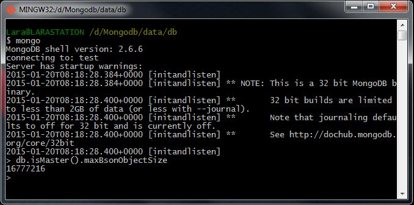

# Homework 1.1

Download and install MongoDB from [www.mongodb.org](http://www.mongodb.org/ "MongoDB official site"). Then run the database as a single server instance on your PC (that is, run the mongod binary). Then, run the administrative shell.

From the shell prompt type:

```sh
db.isMaster().maxBsonObjectSize
```
at the ">" prompt.

What do you get as a result?

## Answer
16777216

## Procedure

