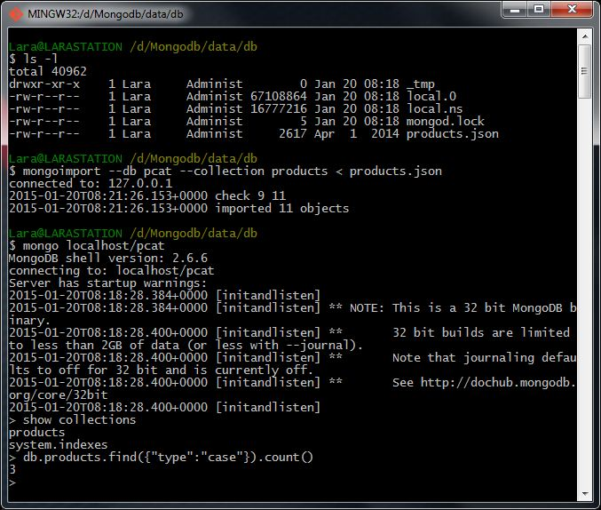

# Homework 1.2

Download the file [products.json](https://university.mongodb.com/static/10gen_2015_M102_January/handouts/products.3eb7cd1a9633.json "Resource file from the MongoDB official site") from education.mongodb.com. Take a look at its content.

Now, import its contents into MongoDB, into a database called "pcat" and a collection called "products". Use the mongoimport utility to do this.

When done, run this query in the mongo shell:

```sh
db.products.find({type:"case"}).count()
```

What's the result?

## Answer
3

## Procedure

