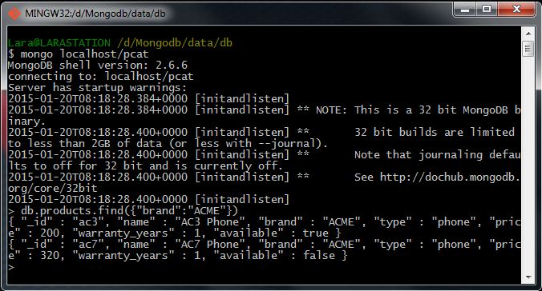

# Homework 1.3

At this point you should have pcat.products loaded from the previous step. You can confirm this by running in the shell:

Download and install MongoDB from [www.mongodb.org](http://www.mongodb.org/ "MongoDB official site"). Then run the database as a single server instance on your PC (that is, run the mongod binary). Then, run the administrative shell.

From the shell prompt type:

```sh
> db.products.find()
> // or:
> db.products.count()
> // should print out "11"
```
Now, what query would you run to get all the products where brand equals the string “ACME”?

## Answer
```sh
> db.products.find({brand:"ACME"})
```

## Procedure

