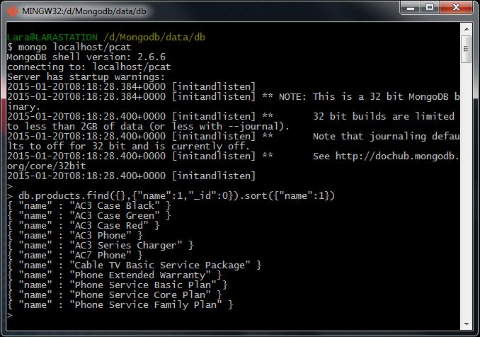
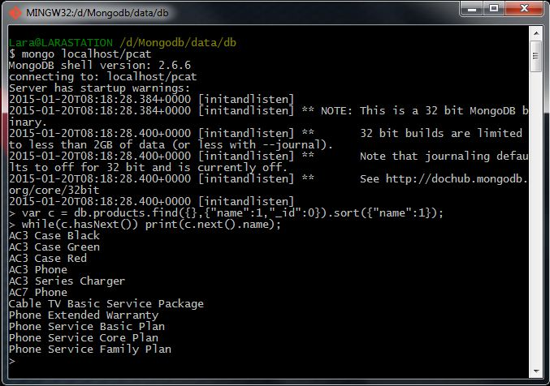
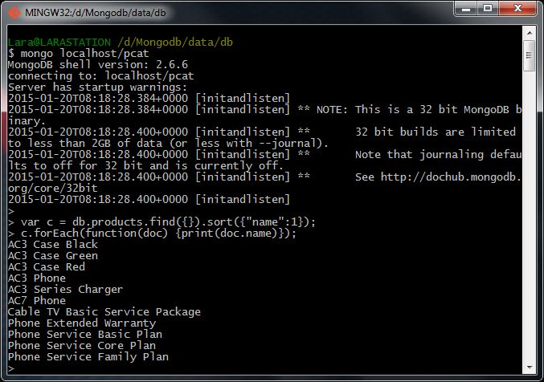

# Homework 1.4

How would you print out, in the shell, the name of all the products without extraneous characters or braces, sorted alphabetically, ascending?

(Check all that would apply.)

1. db.products.find({},{name:1,_id:0}).sort({name:1})
2. var c = db.products.find({},{name:1,_id:0}).sort({name:1}); while( c.hasNext() ) print( c.next().name);
3. var c = db.products.find({}).sort({name:1}); c.forEach( function(doc){ print(doc.name) } );
4. var c = db.products.find({}).sort({name:-1}); while( c.hasNext() ) print( c.next().name);

## Answer
Options **2** and **3**.

## Procedure
The **option #1** doesn't provide the requested result, because this query returns more information than the test is asking for.

The **option #2** is right because this query returns the specific information than the test is asking for.

The **option #3** is also right because this query returns the specific information than the test is asking for.

The **option #4** is wrong because this query returns the specific information than the test is asking for but the information is sorted descendant (from Z to A).

