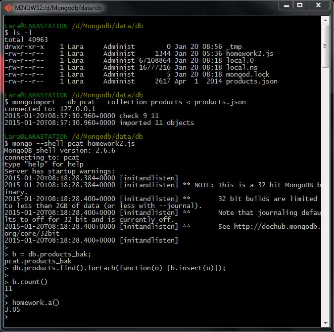

# Homework 2.1

We will use the pcat.products collection from week 1. So start with that; if not already set up, import it:

```sh
mongoimport --db pcat --collection products < products.json
```

You can find [products.json](https://university.mongodb.com/static/10gen_2015_M102_January/handouts/products.3eb7cd1a9633.json "Resource file from the MongoDB official site") from the Download Handouts link. In the shell, if you type:

```sh
> db.products.count()
```

Next, download [homework2.js](https://university.mongodb.com/static/10gen_2015_M102_January/handouts/homework2.a51ae9e0ff0e.js "Resource file from the MongoDB official site") from the Download Handouts link. Run the shell with this script:

```sh
mongo --shell pcat homework2.js
```

First, make a mini-backup of the collection before we start modifying it. In the shell:

```sh
> b = db.products_bak; db.products.find().forEach( function(o){ b.insert(o) } )
// check it worked:
> b.count()
// should print 11
```

If you have any issues you can restore from "products_bak"; or, you can re-import with mongoimport. (You would perhaps need in that situation to empty the collection first or drop it; see the --drop option on mongoimport --help.) At the shell ">" prompt type:

```sh
homework.a()
```
What is the output? (The above will check that products_bak is populated.)

## Answer
3.05

## Procedure

