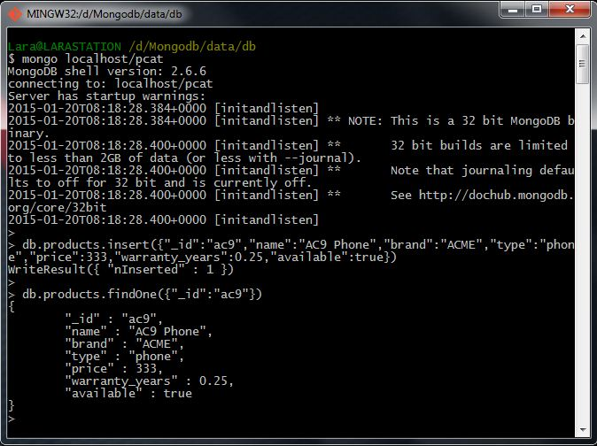

# Homework 2.2

Add a new product to the products collection of this form:

```sh
{
	"_id" : "ac9",
	"name" : "AC9 Phone",
	"brand" : "ACME",
	"type" : "phone",
	"price" : 333,
	"warranty_years" : 0.25,
	"available" : true
}
```

Note: in general because of the automatic line continuation in the shell, you can cut/paste in the above and shouldn't have to type it all out. Just enclose it in the proper statement(s) to get it added. Next, load into a shell variable the object corresponding to

```sh
_id : ObjectId("507d95d5719dbef170f15c00")
```
* Then change `term_years` to 3 for that document. (And save that to the database.)
* Then change over_rate for `sms` in limits to 0.01 from 0. Save that too.

At the shell prompt type:

```sh
> homework.b()
```
What is the output?

## Answer
0.050.019031

## Procedure

Firstly I'm going to store the new product through this sentence:

```sh
> db.products.insert({"_id":"ac9","name":"AC9 Phone","brand":"ACME","type":"phone","price":333, "warranty_years":0.25,"available":true})
```

In order to verify that the new product has been correctly recorded, we can execute the next command:

```sh
> db.products.findOne({"_id":"ac9"})
```


Continuing with the exercise, I'm going to check if the requested product actually exists into the collection. To do that, I'm going to excecute this sentence:

```sh
> db.products.findOne({"_id":ObjectId("507d95d5719dbef170f15c00")})
```


Now, I'm going to obtaining the specified item as JSON in order to be edited.

```sh
> myVar = db.products.find({"_id":ObjectId("507d95d5719dbef170f15c00")},{}).toArray()[0]
```

This commando obtain the selected document as a JSON instead of a BSON pointer. This way, now we are able to edit its content. In fact, we can query the specified fields.


This way, I'm going to change the `term_years` field to 3 and then, I'll update the document with next instructions:

```sh
> myVar.term_years = 3;
> db.products.save(myVar);
```


Next, I'm going to do the same operations but with the second parameter through these sentences:

```sh
> myVar.limits.sms.over_rate = 0.25;
> db.products.save(myVar);
```


Finally, in order to answer the test question, I'm going to execute the final command:

```sh
> homework.b()
```


