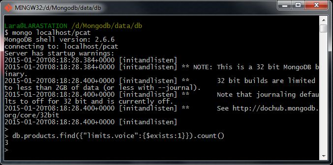

# Homework 2.3

How many products have a voice limit? (That is, have a voice field present in the limits array.)

## Answer
3

## Procedure
In order to solve this task, I'm going to use the **$exists** selector through this sentence:

```sh
> db.products.find({"limits.voice":{$exists:1}}).count()
```


