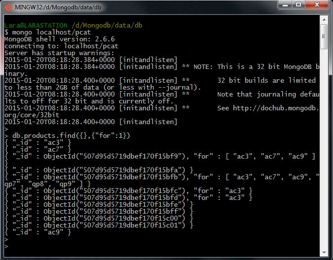
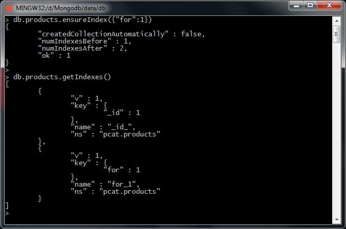
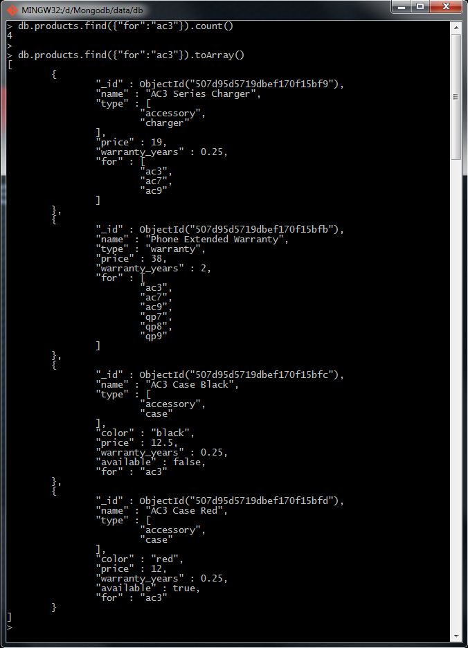

# Homework 2.4

Create an index on the field ``for``. You might want to first run the following to get some context on what is present in that field in the documents of our collection:

```sh
> db.products.find({},{for:1})
```

After creating the index, query products that work with an "ac3" phone; that is, "ac3" is present in the product's "for" field.

Q1: How many are there?

Q2: Run an explain plan on the above query. How many records were scanned?

Q3: Was an index used?

* Q1: 0
* Q1: 1
* Q1: 3
* Q1 : 4


* Q2 : 1
* Q2 : 4
* Q2 : 5
* Q2 : 12


* Q3 : No
* Q3 : Yes

## Answer
Q1 : 4

Q2 : 4

Q3 : Yes

## Procedure
I'm going to begin executing the checking elements sentence:

```sh
> db.products.find({},{for:1})
```



Once I have verified the documents, I'm going to set the new index through these commands:

```sh
> db.products.ensureIndex({"for":1})
> db.products.getIndexs()
```



In order to solve the task requirements, I'm going to execute next commands:

```sh
> db.products.find({"for":"ac3"}).count()
> db.products.find({"for":"ac3"}).toArray()
```


