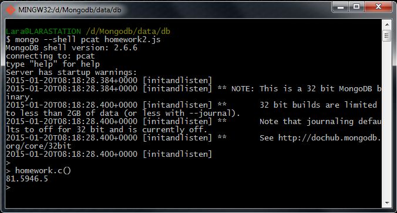

# Homework 2.5

Referring back to 2.4 above, update those products (products that work with an "ac3" phone) and add 2 to the "price" of each of those items. Then, at the shell prompt type:

```sh
> homework.c()
```

## Answer
89.5954.5

## Procedure
Once I have run the MongoDB shell with the Javascript file, I'm going to execute the next command:

```sh
> homework.c()
```


