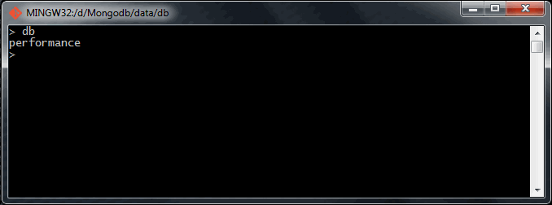

# Homework 3.1

Start a ``mongod`` server instance (if you still have a replica set, that would work too).

Next, download the  [handout](https://university.mongodb.com/static/10gen_2015_M102_January/handouts/performance.002b61f3a932.zip M102 Week 3 Handout resources) and run:

```sh
mongo --shell localhost/performance performance.js
> homework.init()
>
```

Build an index on the "active" and "tstamp" fields. You can verify that you've done your job with

```sh
> db.sensor_readings.getIndexes()
```

When you are done, run:

```sh
> homework.a()
```

Note: if you would like to try different indexes, you can use ``db.sensor_readings.dropIndexes()`` to drop your old index before creating a new one. (For this problem you will only need one index beyond the _id index which is present by default.)

## Answer
6

## Procedure
Firstly, once I have downloaded the requested file, I'm going to check that this one is located into the correct ``/data/db`` folder.


Now, I'm going to run the Mongo shell with a direct connection to the specified database and loading the building script defined by the ``performance.js`` file. To do that, I'm going to execute the next sentence:

```sh
mongo.exe --shell localhost/performance performance.js
```

Then, I initialize the script through the next command:

```sh
> homework.init()
```


Once the script has been loaded correctly, I declare indexes using this command:

```sh
> db.sensor_readings.ensureIndex({"active":1, "tstamp":1}, {"sparse":1})
```

In the first parameter of the command I'm defining the fields which I want to set as collection indexes.

In the other hand, with the second parameter I'm setting that it could be possible to store documents which don't contain some of these fields.



After I have created indexes, I check if they are correctly registered into the collection. To do that, I'm going to execute the next command:

```sh
> db.sensor_readings.getIndexes()
```

This way, I can verify that two new indexes have been created.


Finally, I obtain the result for this task by the ``homework.a()`` method execution.


