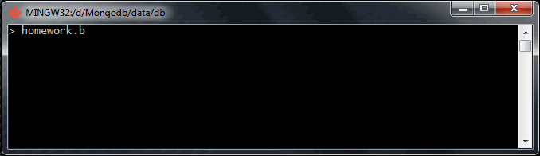
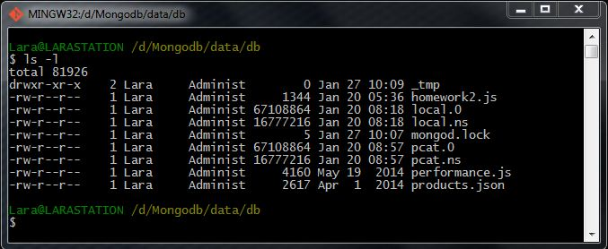
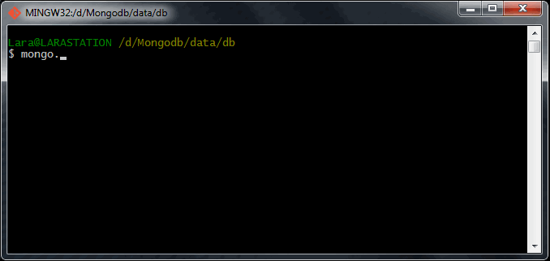
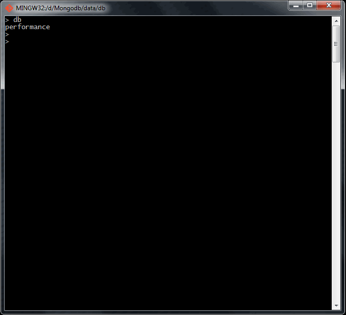
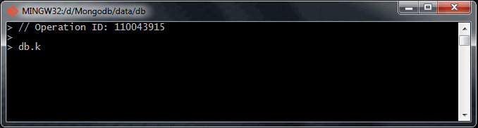
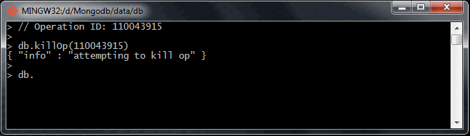
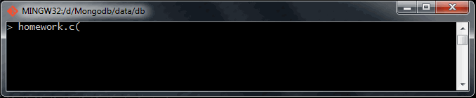

# Homework 3.2

In a mongo shell run ``homework.b()``. This will run in an infinite loop printing some output as it runs various statements against the server.

We'll now imagine that on this system a user has complained of slowness and we suspect there is a slow operation running. Find the slow operation and terminate it.

In order to do this, you'll want to open a second window (or tab) and there, run a second instance of the mongo shell, with something like:

```sh
$ mongo --shell localhost/performance performance.js
```

Keep the other shell with ``homework.b()`` going while this is happening. Once you have eliminated the slow operation, run (on your second tab):

```sh
homework.c()
```
and enter the output below. Once you have it right and are ready to move on, ctrl-c (terminate) the shell that is still running the ``homework.b()`` function.

## Answer
12

## Procedure
In order to develop this task successfuly, I'm going to need two different CLI consoles, in addition to the main one where I have running the ``mongod`` server.

Once said that, on the first terminal I'm going to execute the ``homework.b()`` method as the task says. This function will create a simulation of a long time procedure.



Now, I'm going to run on the second console a new Mongo shell as I did with the first one, so by this reason, I check that the ``performance.js`` file continues into the ``/data/db/`` folder and then, I run the shell.





Once the shell is running, I ask about what operations have been executed right now through this command:

```sh
> db.currentOp()
```

This command returns an array with information about the differente process which are running. For this exercise there is just one which ID is 110043915.



Now I'm going to stop that process through this command:

```sh
> db.killOp(110043915)
```



After stopping the procedure, I execute the ``currentOp()`` method again, in order to verify that the selected operation has been stop.



Finally, I execute the defined instruction in the task.


