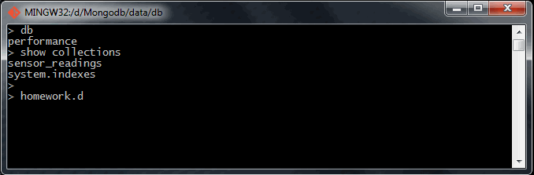
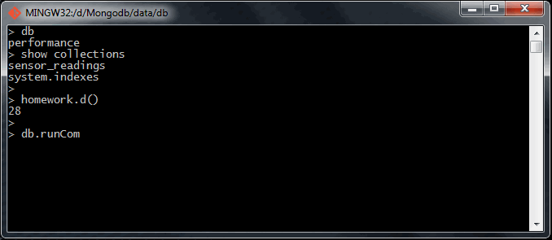
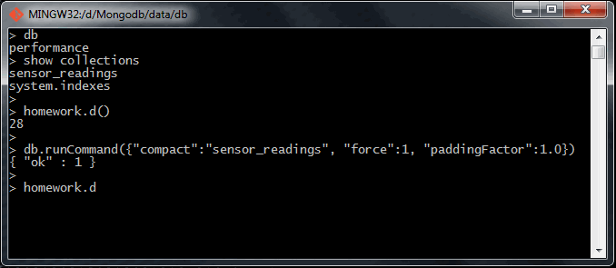

# Homework 3.3

Compact the ``performance.sensor_readings`` collection, with paddingFactor set to 1.0. Then run ``homework.d()`` and enter the result below.

Note: If you happen to be running a replica set, just compact on the primary and run ``homework.d(``) on the primary. You may need to use the ``force:true`` option to run compact on a primary. You may also want to look at ``paddingFactor`` in the docs. Prior to 2.6, you would have been able to do this problem without ``paddingFactor``, but now that ``powerOfTwoSizes`` is on by default, you'll need to use it in order to fully compact the collection.

## Answer
21

## Procedure
Before to do the compression operation, I'm interested on knowing what is the previos ``homework.d()`` function value, so I execute it with the next result.



Once I know what is the wrong answer, I'm going to compact the collection through the next command:

```sh
> db.runCommand({"compact":"sensor_readings", "force":1, "paddingFactor":1.0})
```



With the ``db.runCommand`` I'm defining about what database I want to execute the command.

The ``"compact":"sensor_readings"`` section is defining what collection I want to operate.

The ``"force":1`` section is over-writting the PowerOf2Sizes default value.

And finally, the ``"paddingFactor":1.0`` section is defining that I want a 0% of padding after documents.

In order to enlarge info about the ``compact``, you can take a look to the [official command documentation](http://docs.mongodb.org/manual/reference/command/compact/ MongoDB official "compact" command documentation).

Finally, we can execute the last applied method for with the next result.


